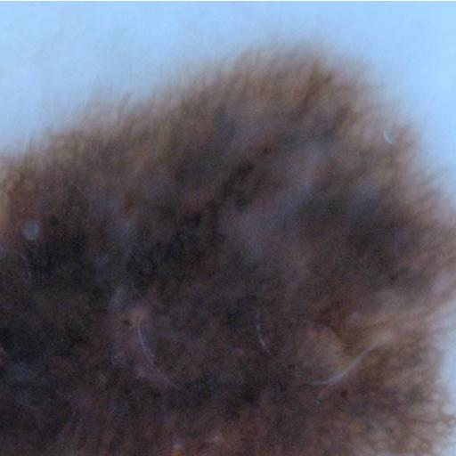

# Skin_Legion_segmentation

## Data Preparation

Download Lesion segmentation dataset from:
[ISIC 2018 website](https://challenge2018.isic-archive.com/).

Dataset contains 2594 images and their corresponding groundtruth of size around 3000x3000.

Example of data:

 
 

* We apply a sliding window of size 512x512 with step size =350; on each image in the data and its
corresponding ground truth. 
* We keep only the cropped windows that have at least 30% foreground and at maximum 85% background.
* We select randomly a maximum of 9 samples from each image.

* To apply the transformation run:

`python data_processing.py --path_images /path/to/images --path_gt /path/to/groundtruth`

* Choose a subset of data and move it to testA and testB folders inside `./lesion_dataset`.

* Example of training data inputs (size 512x512):

 

 
 
 

 

## Experiments:

### Image to Image mapping

To train:

L2 loss: `python train.py --name seg_l2 --model lesion --batch_size 4 --dataroot ./datasets/lesion_dataset --gpu_ids 0`

BCE loss: `python train.py --name seg_bce --model lesion --batch_size 4 --dataroot ./datasets/lesion_dataset --gpu_ids 0 --loss_type bce`

1.Network architecture: UNet

2.Experiment with L2 Loss

 
2.1.  Training results:

2.1.1. Training curve

 2.1.2. Network Output Respectively after 200 epochs: 
 
 `Input image; Output segmentation; Target`

    
2.2. Testing results:
    
2.2.1. Output Images: 

We use [Otsu thresholding](http://www.labbookpages.co.uk/software/imgProc/otsuThreshold.html)
to generate the binary image from the network output.

Respectively: `Input image; Target; Output segmentation; True Positive; Wrongly classified`

2.2.2. Testing Loss:
        

 2.2.3. Testing Accuracy:

        

3.Experiment with binary cross entropy loss

3.1.  Training results:

3.1.1. Training curve

3.1.2. Network Output Respectively after 200 epochs: 

`Input image; Output segmentation; Target`

3.2. Testing results:
    
3.2.1. Output Images: 

Similar to l2 loss; We use [Otsu thresholding](http://www.labbookpages.co.uk/software/imgProc/otsuThreshold.html)
to generate the binary image from the network output.

Respectively: `Input image; Target; Output segmentation; True Positive; Wrongly classified`

3.2.2. Testing Loss:
        

3.2.3. Testing Accuracy:

4.Comparison between the two losses:

| Loss     | Accuracy |
| ---      | ---       |
| Mean Squared Error | 0.832071031842913       |
| Binary Cross entropy     | 0.8290215083530971       |

### Generative adversial network experiment

To train: 

`python train.py --name gan_seg_l2 --model lesion_gan --batch_size 4 --dataroot ./datasets/lesion_dataset --gpu_ids 0 --netD test`

1. Generator and Discriminator architecture:

    1.1. Generator: Unet like architecture
    
    1.2. Discriminator:
    
    

##### Testing Results:

Respectively: `Input image; Target; Output segmentation; True Positive; Wrongly classified`

Testing accuracy:

After 200 epochs accuracy of:

Test Accuracy: 0.8516359056745256

